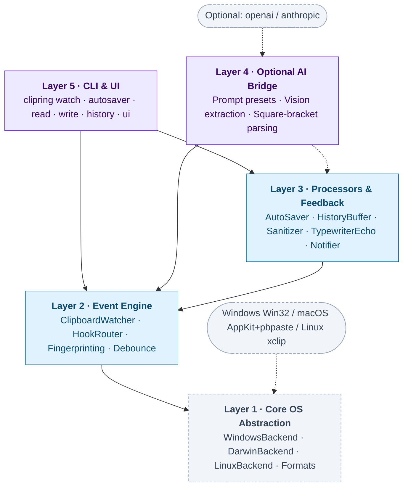

# ClipRing Architectural Design

Version: 0.2.0

**ClipRing** is a cross-platform Python library, event engine, and CLI that transforms the system clipboard into a first-class, creative input stream. It provides multi-format extraction (text, HTML, images, and files), intelligent background event watching with fingerprint deduplication, automated image saving (including animated WebP and GIF recovery), privacy sanitization, and optional LLM copilot extensions.

---

## 1. Design Goals

1. **Clipboard as a Creative Input Mechanism**: Treat the operating system clipboard not merely as a temporary text scratchpad, but as an asynchronous event stream capable of driving workflows across text, rich HTML, screenshots, animated images, and file selections.
2. **True Cross-Platform Support**: First-class support for **Windows** and **macOS**, with seamless **Linux** (X11 / Wayland) compatibility. Avoid hardcoding platform-specific paths or assemblies in the core layer.
3. **Layered Decoupling**: Core clipboard operations require zero agent/LLM dependencies. The core toolkit imports instantly and runs with minimal overhead. AI integrations remain strictly secondary and optional.
4. **Privacy & Security by Design**: Because user clipboards frequently contain confidential tokens, passwords, or personal communications, ClipRing includes built-in credential sanitization, sandboxed output paths, and no unsolicited external network transmissions.

---

## 2. Layered Architecture

### Dependency Invariant
Dependencies flow exclusively downward:
- `clipring.core` depends only on Pillow and pyperclip.
- `clipring.extract` depends only on Pillow and the standard library.
- `clipring.engine` depends on `core` and `extract`.
- `clipring.processors` depends on `core`, `extract`, and `engine`.
- `clipring.ai` is completely optional (`pip install clipring[ai]`).

---

## 3. Layer Specifications

### Layer 1: `clipring.core`

| Module | Responsibility |
|---|---|
| `backend.py` | `ClipboardBackend` abstract base class defining operations: `read_text`, `write_text`, `read_image`, `read_html`, `read_files`, `clear`. |
| `models.py` | Typed dataclasses: `ClipboardItem`, `ContentType`, and `ImagePayload`. Computes SHA-256 state fingerprints. |
| `windows.py` | `WindowsBackend`: Win32 / PowerShell CF_HTML parsing, Explorer file droplists, and Pillow image grab. |
| `darwin.py` | `DarwinBackend`: macOS pasteboard integration via `AppKit`, `pbcopy`/`pbpaste`, Finder selection, and Pillow. |
| `linux.py` | `LinuxBackend`: `xclip` and `wl-clipboard` (Wayland) integration. |
| `manager.py` | `Clipboard` facade and `get_backend()` platform detector. |

### Layer 2: `clipring.extract`

Modern web browsers copy images using complex HTML envelopes with embedded `data:image/webp;base64` or `` references. This layer extracts and reconstructs binary image data:

| Module | Responsibility |
|---|---|
| `html_parser.py` | Extracts image URLs, decodes base64 data URIs, and extracts WebP payloads embedded in browser HTML. |
| `image_utils.py` | Image hashing, animation detection (`is_animated_image`), animated WebP to GIF conversion, and format serialization. |
| `screenshots.py` | Dynamically locates system screenshot directories across Windows (including OneDrive redirection), macOS (`~/Desktop`, `~/Pictures`), and Linux. |

### Layer 3: `clipring.engine`

The event engine drives reactive clipboard programming:
- **Fingerprinting**: Each clipboard snapshot computes a SHA-256 fingerprint from content data. Identical items copied consecutively are ignored.
- **HookRouter**: Evaluates decorators (`@watcher.on_text`, `@watcher.on_image`, `@watcher.on_files`, `@watcher.on_command`) with regex patterns and length bounds.
- **Debounce & Lifecycle**: Configurable polling interval with pause/resume capabilities and background thread management.

### Layer 4: `clipring.processors`

Reusable middleware components for clipboard workflows:
- **`AutoSaver`**: Monitors copied images and files, persisting them immediately with hashing deduplication and desktop notifications.
- **`Sanitizer`**: Identifies sensitive tokens (JWT, OpenAI, GitHub, AWS, passwords) using regular expression patterns and masks them prior to logging or history storage.
- **`HistoryBuffer`**: Thread-safe circular ring buffer retaining recent clips with search and recall.
- **`TypewriterEcho`**: Splits text responses into word-aligned chunks and outputs them to the clipboard with configurable pacing delays.
- **`Notifier`**: Cross-platform desktop notification dispatcher (Windows Balloon/Toast, macOS Notification Center, Linux notify-send).

### Layer 5: `clipring.cli` & UI

A Typer and Rich command-line interface:
- `clipring watch`: Live streaming clipboard monitor in terminal.
- `clipring autosaver`: Headless image/file saving daemon.
- `clipring read` / `clipring write`: Shell piping.
- `clipring history`: History inspection.
- `clipring ui`: Built-in local HTTP server serving the interactive Cyberpunk web dashboard.
